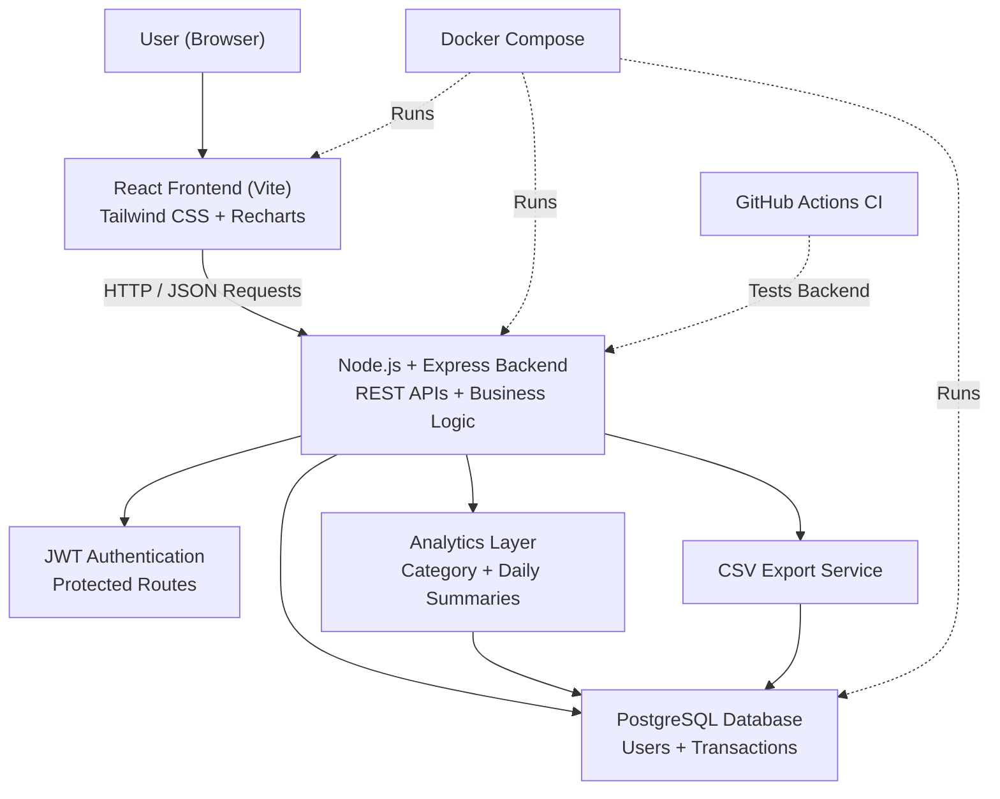
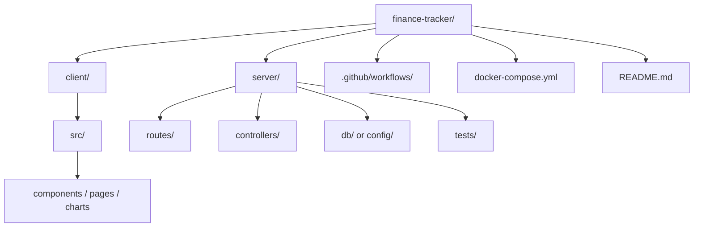

# ProFin — Personal Finance Tracker

ProFin is a full-stack personal finance application designed to help users seamlessly track income and expenses, visualize spending analytics, and manage their financial health securely. 

Built with a focus on real-world engineering practices, this project demonstrates robust backend architecture, responsive frontend design, and modern DevOps workflows.

---

## Key Features

* **Secure Authentication:** JWT-based user registration and login with protected backend APIs.
* **Transaction Management:** Easily add, track, and manage both income and expense transactions.
* **Financial Analytics:** Visualize spending patterns with category-based and daily interactive charts.
* **Monthly Summaries:** Get quick, high-level suggestions into your monthly financial health.
* **Data Export:** Export transaction history to CSV for external use or record-keeping.
* **Containerized Environment:** Fully Dockerized setup ensures a consistent experience across all environments.
* **CI/CD Integration:** Automated backend testing on every push using GitHub Actions.

---

### Tech Stack

1. Frontend: 
* **React (Vite)** – For a fast, modern user interface.
* **Tailwind CSS** – For rapid, responsive styling.
* **Recharts** – For rendering interactive financial graphs.

2. Backend: 
* **Node.js & Express.js** – RESTful API architecture.
* **PostgreSQL** – Relational database for secure data storage.
* **JWT** – For stateless, secure user authentication.

3. DevOps & Infrastructure
* **Docker & Docker Compose** – Containerization for seamless local development.
* **GitHub Actions** – Continuous Integration (CI) for automated testing.

4. Architecture Diagram

---

####  Project Structure

---
##### Getting Started 

The easiest way to run this application locally is by using Docker.

* ** Prerequisites 
1. Docker
2. Docker Compose

* ** Installation & Setup
1. Clone the repository:
git clone [https://github.com/lohith-mudipalli/finance-tracker.git](https://github.com/lohith-mudipalli/finance-tracker.git)
cd finance-tracker
2. Start the application: 
docker-compose up --build
3. Access the app:
Frontend UI: http://localhost:5173
Backend API: http://localhost:5001

* ** Testing
The backend includes a suite of automated tests to ensure reliability. These tests are configured to run automatically via GitHub Actions whenever code is pushed to the main branch.
To run the backend tests locally:
cd server
npm install
npm test

---

###### Why This Project Exists

This project was developed to simulate a real-world fintech application, emphasizing:
1. Secure backend development and clean API design.
2. Building robust, database-driven applications.
3. Leveraging Docker for frictionless development environments.
4. Implementing automated testing and CI workflows.
5. It serves as a practical example of how production-ready full-stack systems are structured, built, and maintained.

###### Future Improvements
1. OAuth Integration (Google Login)
2. Customizable Budget Alerts & Notifications
3. Cloud Deployment (AWS / Render)
4. PDF Report Generation

###### ####### Author
Lohith Reddy Mudipalli
